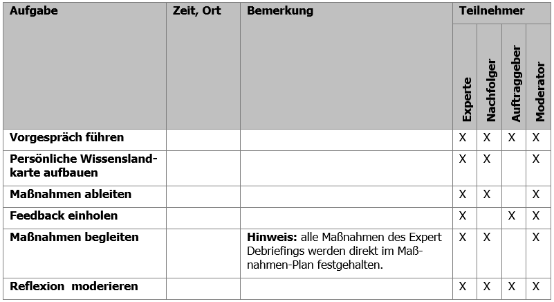

# Grundlagen

Viele Organisationen sehen sich in der Wissensgesellschaft des 21. Jahrhundert mit einer ganz besonderen Situation konfrontiert. Durch Globalisierung, Digitalisierung sowie schnelle technologische und wissenschaftliche Entwicklung sehen sie sich einem bisher nicht da gewesenen Wettbewerbsdruck gegenübergestellt. Auch der Charakter der Arbeit hat sich geändert. Bestand die Arbeit 1930 noch zu ca. 80% aus manueller Routinearbeit, so dominiert heute die Wissensarbeit. Gleichzeitig führt die Alterung der Gesellschaft durch den demografischen Wandel, Fachkräftemangel und Job-Rotationen zu Verlust von wertvollem Erfahrungswissen und Schwächung der  Innovationskraft. Deswegen sollten Unternehmen systematische Prozesse der  Wissenssicherung etablieren. Mit dem Expert Debriefing erlernst Du eine  Methode zur systematischen Bewahrung des Wissens von Experten.

Die Methode Expert Debriefing dient dazu, das Wissen eines ausscheidenden oder wechselnden Experten der Organisation zu bewahren sowie dem Experten Wertschätzung für seine Leistungen zu zeigen. Um diesen Prozess systematisch zu gestalten, wird ein Expert Debriefing von einem ausgebildeten Moderator begleitet. Expert Debriefings können bei Fach- und Führungskräften gleichermaßen sowie in allen funktionalen Bereichen (Marketing, Vertrieb, Entwicklung, Produktion, Service) durchgeführt werden. Der Begriff des Experten ist hierbei immer relativ in Beziehung zu einer Bezugsgruppe, den Laien, zu verstehen.

Da jeder Experte mit seinem Wissen und seiner Neigung zu Werkzeugen der Wissensbewahrung unterschiedlich sind, gibt es keinen One-Size-Fits-All-Ansatz geben. Der Expert Debriefing Referenzprozess ist deshalb so aufgebaut, dass zunächst in einer persönlichen Wissenslandkarte des Experten Überblick über alle möglichen Wissensgebiete aufgebaut wird, um dann auf Basis dieser Übersicht die wichtigsten Maßnahmen auszuwählen. Zur Auswahl der Maßnahmen steht die Expert Debriefing Toolbox mit praxiserprobten Tools und Methoden zur Verfügung. 

Mit diesem Leitfaden lernst du alle Grundlagen des Expert Debriefings kennen. Mit den Übungen (Katas) aus dem Lernpfad lernst du den ganzen Prozess kennen.  

## Geschichte des Expert Debriefings

Anhand der folgenden Punkte ist die Geschichte des Expert Debriefings kurz dargestellt (ausführlich unter [Geschichte der Cogneon Methode Expert Debriefing](https://wiki.cogneon.de/Geschichte_der_Cogneon_Methode_Expert_Debriefing)).

- Ende der 1990er: Wissensbewahrungsprojekte mit dem Fokus Wissensdokumentation bei der Audi AG
- Ab 1999: Entwicklung eines expliziten „Expert Debriefing Prozesses“ für Einzelexperten
- 2002/2003: Erste Multiplikatorenschulungen bei Volkswagen (dort  Wissensstafette genannt, 2006 Gewinn des Preises Wissensmanager des  Jahres)
- 2005: Expert Debriefing Einführung bei Schaeffler, dort Kopplung mit Wiki und Wissensgemeinschaften
- Ab 2007: Flächendeckende Verbreitung von Expert Debriefing durch offenes Schulungsangebot

Das Expert Debriefing wird auch unter den Synonymen Wissensstafette,  Transferwerk, Wissensstaffel, Keep Experience  und Strukturierte  Wissensweitergabe in diversen Unternehmen angewendet. Seit Juni 2011  gibt es eine Expert Debriefing Benchlearning Gruppe, in der sich  Unternehmen, mit langjähriger Anwendungserfahrung, regelmäßig  austauschen.

## Warum ist Wissensbewahrung heute wichtig?

„Nicht Arbeit, nicht Kapital, nicht Land und Rohstoffe sind die  Produktionsfaktoren, die heute in  unserer Gesellschaft zählen, sondern  das Wissen der Mitarbeiter in den Unternehmen.“  Peter F. Drucker (1909 - 2005)

An vier Einflussfaktoren wird die Bedeutung der Wissensbewahrung genauer betrachtet:

1. Wissensgesellschaft - Wissen macht den Unterschied
2. Demografischer Wandel – wenn Erfahrung in Rente geht
3. Fachkräftemangel – wenn immer weniger immer mehr machen müssen
4. Fluktuation – neue Jobrealitäten

### Wissensgesellschaft - Wissen macht den Unterschied

In der Drei-Sektoren-Hypothese von Jean Fourastié beschreibt er,  dass sich der Schwerpunkt der wirtschaftlichen Tätigkeit zunächst vom  primären Wirtschaftssektor (Rohstoffgewinnung), auf den sekundären  Sektor (Rohstoffverarbeitung) und anschließend auf den tertiären Sektor  (Dienstleistung) verlagert.

Der erste Sektor wird auch als Agrargesellschaft bezeichnet. Der  Fokus lag hier in der  forst- und landwirtschaftlichen  Erzeugung. Mit  dem technischen Fortschritt und der industriellen Revolution erfolgt  auch der Umschwung  in den sekundären Sektor, der Industriegesellschaft.  Hier stand die industrielle Produktion im Vordergrund. Im Laufe der  Zeit wandelte sich der Fokus zur Erbringung von Dienstleistungen und  damit gesellschaftlich zum tertiären Sektor – der  Dienstleistungsgesellschaft.

In der Dienstleistungsgesellschaft erfolgte immer stärker die  Verlagerung auf immaterielle Güter. „Wissen“ wurde vierter  Produktionsfaktor  und gewinnt immer mehr an Bedeutung. Mit mindestens  60 % ist es heute  in vielen Unternehmen für die Gesamtwertschöpfung des Unternehmens verantwortlich. Damit einhergehend wuchs ständig das Feld  der  wissensintensiven Tätigkeiten und Berufe. Gehörten  1930 noch 83%  dem Arbeitstyp „Arbeiter“ (Produktion, Rohstoffgewinnung,  Landwirtschaft)  an, waren es 2000 nur noch 15%. Demgegenüber  stiegen  im gleichen Zeitraum der Arbeitstyp „Service-Arbeiter“ (Büro Jobs,  Handel, Basisdienstleistungen) von 6% auf 15 % an und der Arbeitstyp  „Wissensarbeiter“ (Beratung, Coaching, F&E, Management) von 8% auf  25%.

Wissen wird damit zur strategischen Ressource in Produkten und  Dienstleistungen. Das Wissen ist vernetzt, dezentral und  interdisziplinär. Die effektive Nutzung des Wissens wird zum  entscheidenden Wettbewerbsfaktor, die Gesellschaft ist damit in der  Wissensgesellschaft angekommen.

Neben diesem ökonomischen Trend gibt es noch einen weiteren  gesellschaftlichen Trend, den des demografischen Wandels. Der  demografische Wandel  beschreibt eine älter werdenden oder alternde  Gesellschaft. Dieser Wandel hat große Auswirkungen auf alle  gesellschaftlichen Bereiche. Bis 2030 sinkt die Bevölkerung um fünf  Millionen, es  gibt 17% weniger Kinder und Jugendliche und 33% mehr  Bürger über 65 Jahren, die Gruppe der Personen im erwerbsfähigen Alter  schrumpft um 15%.

Was bedeutet es für Unternehmen, wenn einerseits immer höhere  Anforderungen durch die Wissensgesellschaft an sie herangetragen werden  und andererseits immer weniger Mitarbeiter zur Verfügung stehen?

### Demografischer Wandel – wenn Erfahrung in Rente geht

Viele der Mitarbeiter, die heute oder in den nächsten Jahren in Rente gehen,  haben die Unternehmen, in denen sie beschäftig sind, mit Aufgebaut. Sie  haben große Errungenschaften erlebt, aber auch die ein oder andere  Katastrophe.  Damit haben sie einen großen Erfahrungsschatz angesammelt  und dieser steht nun kurz davor, die Unternehmen, gemeinsam mit ihren  Wissensträgern,  zu verlassen.  Natürlich wurden im Laufe der Jahre auch Dokumentationen erstellt. Aber häufig stellen sich die Fragen: Wo ist  was dokumentiert? Was ist noch für die Zukunft wichtig und wurde bislang noch nicht festgehalten? Wie können Erfahrungen bewahrt und  transferiert werden?

### Fachkräftemangel – wenn immer weniger immer mehr machen müssen

Auch wenn die Hörsäle aktuell eher überfüllt sind, werden sie tendenziell  leerer werden. Schon heute mangelt es  an Fachkräften in der Wirtschaft. Rund 11 Mrd. Euro sind es allein in der IT-Branche, die durch Wissens-  und Kompetenzverlust entstehen. Diese Lücke entsteht u.a. auch dadurch,  dass es nicht genügend Fachkräfte für die Nachbesetzung gibt bzw. die  Nachbesetzung sich sehr lange hinzieht (durchschnittliche Vakanzzeiten  von 55 Tagen über alle Positionen hinweg und bis zu 90 Tagen bei  technischen Berufen). Was kann getan werden, wenn immer weniger immer  mehr machen müssen? Wie kann sich ein Unternehmen vor  dem  Wissensverlustrisiko besser schützen?

### Fluktuation – neue Jobrealitäten

Das Mitarbeiterengagement ist seit 2004 gesunken.  33 % der Arbeitnehmer in Deutschland denken ernsthaft darüber nach, das Unternehmen zu wechseln. Dabei liegt die Wechselbereitschaft der bis 24-Jährigen liegt bei 50 %  und die der  25- bis 34-Jährigen um 40 %. Das ist die Gruppe der jungen  Talente, um die im „War for talents“ im Zuge des Fachkräftemangels so  begehrlich gekämpft wird.

Das Arbeitsmodell „Arbeit in einem Unternehmen bis zur goldenen  Uhr“ hat ausgedient. Gelebte Work-Life-Balance, Individualisierung und  Selbstverwirklichung sind aktuelle Trends. Damit steht auch fest, dass  es einen anderen Umgang mit dem Thema Wissen bzw. Wissensbewahrung in  den Unternehmen geben muss. Wie stellt sich ein Unternehmen auf diese  neuen Jobrealitäten ein? Welche Möglichkeiten der Wissensbewahrung gibt  es?

## Implizitem und explizites Wissen transferrieren

Ergänzen: implizites Wissen, Deep Smarts

Der Ausdruck „Wissen“ stammt von althochdeutsch „wizzan“ bzw. der  indogermanischen Perfektform „woida“ und bedeutet  „ich habe gesehen“,  somit auch  „ich weiß“. Im Wissenstransfer kann man das sehr leicht  beobachten. Kleine Kinder lernen am Anfang durch beobachten und  nachmachen. Wissen wird also transferiert, indem eine Beobachtung  erfolgt. Dieser Mechanismus kann auch auf die Welt der Erwachsenen  übertragen werden. Person A macht etwas und Person B beobachtet Person A dabei. In der  nächsten Stufe spricht Person A mit Person B über etwas. Hier wird der Transfer um die Ebene der Sprache erweitert. Es können  auch beide Stufen durchlaufen werden, d.h.  es wird erst etwas  beobachtet und anschließen oder dabei mit einander gesprochen. Da hier  die direkte Interaktion zwischen den Wissensträger im Vordergrund steht, spricht man auch von der Wissenskommunikation.

Die Person A könnte aber auch etwas dokumentierten und dieses  Dokument ablegen. Wenn Person B dann einen bestimmten Inhalt  sucht,  findet es das Dokument. Person B kann es dann lesen und verstehen. Da in dieser Form des Wissenstransfers das Erstellen (Dokumentieren) von  Wissensobjekten im Vordergrund steht, spricht man auch von der  Wissensdokumentation. Ein Wissensobjekt kann dabei ein Text in einem  Wiki sein, ein Dokument in einem Sharepoint oder auch eine Audio- bzw.  Video-Datei.

Wissenskommunikation und Wissensdokumentation kommen in einem  Unternehmen nie in Reinform vor. Es gibt immer eine Durchmischung.  Dennoch sollte in der Wissensmanagementstrategie entschieden werden, ob  der Fokus eher auf Kodifizierung ausgerichtet ist, also die  Dokumentation in Wiki’s, Dokumentenmanagement Systeme, etc. im  Vordergrund steht oder ob sie eher auf eine Personalisierung  ausgerichtet ist, d.h. die direkte Kommunikation über  Lessons Learned  Workshops, Wissensgemeinschaften, Lerntandems, etc.

**Beispiel:** Ein Experte bekommt täglich viele Anfragen von verschiedenen Personen. Viele der Anfragen wiederholen sich.

- **Lösung mit Fokus auf Wissenskommunikation** - Er bekommt  die Fragen per Telefon oder die Leute kommen direkt zu ihm. Er bespricht mit jedem einzelnem die Fragen. Jeder Einzelne ist sehr zufrieden, es  herrscht eine hohe Bindung an den Experten. Der Experte benötigt dafür  viel Zeit.
- **Lösung mit Fokus auf Wissensdokumentation** - Der Experte  erstellt eine Liste der Häufig gestellten Fragen (FAQ-Liste) mit  entsprechenden Antworten.  Alle eingehenden Fragen verweist er auf die  FAQ Liste.  Er beschäftigt sich nur mit Anfragen, die nicht in der  FAQ-Liste stehen. Die FAQ-Liste wird ständig durch ihn ergänzt. Das  Abweisen auf eine FAQ-Liste kann für viele erst einmal unpersönlich  vorkommen. Dadurch entsteht nicht so eine hohe Bindung an den Experten.  Der Experte hat nach einem anfänglichen Mehraufwand später weniger  Aufwand in der Beantwortung von Fragen. Das Unternehmen hat zudem eine  Wissensbasis, sollte der Experte einmal ausfallen.

Beide Lösungen sind richtig – jedes Unternehmen muss für sich  entscheiden, welches der richtigere Weg ist. Genauso verhält es sich mit den Wissensbewahrungsmethoden. Häufig könnten verschiedene Methoden zum Einsatz kommen. Entscheidend für die Auswahl ist Reifegrad der  Organisation und die strategische Wissensmanagementausrichtung.

## Erfolgsfaktoren für Expert Debriefings

Die Methode Expert Debriefing wurde von Cogneon 1999 entwickelt. Damit kann auf eine lange Zeitperiode zurückgeblickt werden, in der die Methode in unterschiedlichen Branchen und in unterschiedlichen Unternehmensgrößen zum Einsatz kam. Die gesammelten Erfahrungen wurden dazu genutzt, das Expert Debriefing stetig weiterzuentwickeln. Gleichzeitig wurden von Cogneon, als auch von anderen Anwendern der Methode Erfolgsfaktoren identifiziert, die im Folgenden aufgeführt sind.

* **Die Teilnahme am Expert Debriefing ist freiwillig:** Die ausdrückliche Bereitschaft des Experten sein Wissen zu teilen ist existenziell. Die Motivation des Experten, dies zu tun, ist von der Ausgangsbasis für die Durchführung des Expert Debriefings abhängig. Gehen Experten in den Ruhestand oder liegt eine Kündigung des Experten vor und er ist dem Unternehmen wohlgesonnen (z.B. wenn der Experte aus privaten Gründen umzieht), ist eine hohe Motivation vorhanden. Wird unternehmensseitig eine Kündigung ausgesprochen, z.B. im Rahmen von Umstrukturierungsmaßnahmen, kann das Expert Debriefing in die Aufhebungs- oder Sozialverhandlungen mit eingebunden werden. Bei zerrütteten Arbeitsverhältnissen und deren Beendigung ist hingegen kaum noch eine Motivation vorhanden.
* **Vorgesetzte stehen hinter dem Prozess, lassen aber Freiräume zu:** Der Vorgesetzte verantworte die Ressourcen (Zeit des Experten/ ggf. der Nachfolger, Budget, Ort) für die Prozessdurchführung und ist maßgeblich an der Festlegung der Zielinhalte beteiligt. Das Commitment des Vorgesetzten ist daher notwendig, damit die Transfermaßnahmen im Prozessverlauf reibungslos umgesetzt werden können. Sind Auftraggeber und Vorgesetzte nicht identisch, so sind beide in den Prozess zu involvieren. Unstimmigkeiten sind von den beiden Parteien direkt zu klären. Die Erhebung der persönlichen Wissenslandkarte sollte ohne den Vorgesetzten erfolgen, da der Experte dann i.d.R. offener agiert (gerade im Bereich der Lessons Learned)
* **Transparenz schaffen und Erwartungshaltungen der Beteiligten abholen:** Transparenz (Warum das Expert Debriefing erfolgt, Was sind die Inhalte und was passiert mit den Ergebnissen) im Vorfeld erzeugen. Der Abstrakte Prozess kann durch Fallbeispiele konkretisiert werden. Ein Vorgespräch mit Auftraggeber und/oder Vorgesetzen, sowie Experten und falls vorhanden dem Nachfolger nimmt Erwartungen auf, klärt auf und nimmt dadurch Ängste.
* **Den Prozess professionell und auf Augenhöhe moderieren:** Respektvoller und Vertrauensvoller Umgang zwischen Moderator, Experten und Nachfolger ermöglichen das Erheben eines breiten Wissensspektrums und das erschließen „impliziten“ Wissens. Explizites Wissen sollte explizit übergeben werden (Vorhandene Dokumentationen). Implizites Wissen sollte externalisiert werden (z.B. durch Erfahrungsgeschichten und Podcasts). Der Moderator sollte dabei eine gewisse Augenhöhe zum Experten haben, d.h. das Begrifflichkeiten bekannt sind. Dazu muss sich der Moderator ggf. im Vorfeld in die Thematik einlesen.
* **Den Experten durch Wertschätzung motivieren:** Eine Wertschätzung des Experten ist ein hoher Motivationsfaktor für die Bereitschaft, Wissen freizugeben.
* **Den Prozess durch den Moderator strukturieren und kontrollieren:** Das Aufsetzen des Prozesses mit Vorgespräch, persönlicher Wissenslandkarte und Ableitung eines Maßnahmenplans durch den Moderator gibt die Notwendige Struktur. Die Umsetzung des Maßnahmenplans durch das Transfertandem sollte über regelmäßigen Reviews „kontrolliert“ werden. Der Moderator hat hierbei keine inhaltliche Verantwortung, ist aber für die Prozessabwicklung verantwortlich. Werden Maßnahmen nicht termingerecht umgesetzt, muss er intervenieren und ggf. an den Vorgesetzten eskalieren.

## Expert Debriefing Referenzprozess

Der Prozess beinhalte folgende Aufgaben für den Moderator:

1. **Vorgespräch führen:** Das Vorgespräch dient dazu, dem Auftraggeber und dem Experten den Zweck, die Vorgehensweise und die Ergebnisse eines Expert Debriefings aufzuzeigen, von den Beteiligten einen Überblick über die Situation und die Rahmenbedingungen zu erhalten, durch den Auftraggeber den Fokus für das Expert Debriefing festlegen zu lassen und die weiteren konkreten Schritte zu planen. Ein Expert Debriefing sollte immer auf freiwilliger Teilnahme des Experten basieren, da man Wissensteilung nicht erzwingen kann.
2. **Persönliche Wissenslandkarte aufbauen:** Die persönliche Wissenslandkarte dient dazu, einen systematischen und vollständigen Überblick über das gesamte in Bezug auf eine Stelle relevante Wissen herzustellen. Die persönliche Wissenslandkarte kann somit als Wissenslandkarte einer Stelle betrachtet werden. Die persönliche Wissenslandkarte beinhaltet im Gegensatz zu einer Mind Map eine vorstrukturierte erste Ebene (Arbeitshistorie, Aufgaben und Wissensgebiete), um systematisch das Gedächtnis und damit das implizite Wissen des Experten zu aktivieren (Episoden-, prozedurales und deklaratives Gedächtnis).
3. **Maßnahmen ableiten:** Die Ableitung des Maßnahmen-Plans dient dazu, geeignete Maßnahmen zur Wissensbewahrung zu identifizieren, sie sowohl durch Experten als auch durch den Nachfolger priorisieren zu lassen und anschließend alle Maßnahmen zu terminieren.
4. **Feedback einholen:** Das Einholen des Feedbacks dient dazu, einen möglichst objektiven Überblick über die notwendigen Maßnahmen zur Wissensbewahrung zu erhalten und dem Auftraggeber die Möglichkeit zu geben, in den Maßnahmen-Plan korrigierend einzugreifen. Optional kann Vorgesetzter und Nachfolger ca. 3 Monate nach Abschluss des Expert Debriefings befragt werden, ob die Übergabe durch die Methode besser war, als ohne.
5. **Maßnahmen begleiten:** Die Durchführung der im Maßnahmen-Plan festgelegten Maßnahmen ist der Kern des Expert Debriefings und dient der Wissensbewahrung durch Wissensidentifikation, Wissensdokumentation oder Wissenskooperation. Ziel ist, dass Experte und Nachfolger möglichst viele Maßnahmen in Eigenregie und in ihren Arbeitsalltag integriert durchführen. Der Moderator hat hier zwei Rollen: 1. Projektleiter: er wacht darüber, dass die im Maßnahmen-Plan festgelegten Maßnahmen durchgeführt werden. 2. Unterstützer: in 1:NN-Szenarien (Nachfolger noch nicht bekannt) oder bei komplexeren Maßnahmen unterstützt der Moderator bei konkreten Maßnahmen.
6. **Reflexion moderieren:** Die Reflexion dient der Umsetzungskontrolle sowie der kontinuierlichen Verbesserung der Methode Expert Debriefing. Darüber hinaus sollen Verbesserungspotentiale in der Organisation identifiziert werden, die den Einsatz der Methode Expert Debriefing langfristig überflüssig machen können.

Die einzelnen Aufgaben werden in den folgenden Kapiteln im Detail erläutert.

### Vorgespräch führen

Das **Vorgespräch** dient dazu, dem Auftraggeber, dem Experten und dem Nachfolger, sofern schon vorhanden, den Zweck, die Vorgehensweise und die Ergebnisse eines Expert Debriefings aufzuzeigen. Der Moderator erhält von den Beteiligten einen Überblick über die Situation und die Rahmenbedingungen, lässt durch den Auftraggeber den Fokus für das Expert Debriefing festlegen und plant die weiteren konkreten Schritte.

Damit dient das Vorgespräch auch als Auftragsklärung, d.h. der gesamte Rahmen des Expert Debriefings für Inhalt, Zeitraum (Dauer) und Aufwand (Verfügbarkeit des Experten in dem Zeitraum) wird vereinbart. Besonders wichtig ist hier das Commitment zwischen Auftraggeber (Vorgesetzter) und Experten. Sollten im Prozessverlauf Schwierigkeiten auftreten (z.B. keine Zeit für die Durchführung von Wissensbewahrungsmethoden), kann auf diese "Vereinbarung" zurückgegriffen werden. (In einigen Unternehmen unterschreiben die Beteiligten das Protokoll, womit eine stärkere Bindung erzielt wird.).

**Hinweis:** es wird davon ausgegangen, dass Auftraggeber und Vorgesetzter identisch sind. Ist das nicht der Fall, sollte der Personenkreis erweitert werden.    

**Eingaben (Input)**

- Präsentation Expert Debriefing
- Vorlage Protokoll Vorgespräch
- Vorlage Projektplan

**Vorgehensweise**

**Hinweis:** das Vorgespräch dauert ca. 1 Stunde.

1. Vorstellungsrunde mit Klärung der Rollen.
2. Präsentation Expert Debriefing verwenden, um Vorgehensweise zu erläutern. Offene Fragen beantworten.
3. Situation und Rahmenbedingungen erfragen, Entscheidungen treffen und im Protokoll Vorgespräch festhalten.
4. Termine für Aufbau persönliche Wissenslandkarte, Ableitung Maßnahmen-Plan, Feedback, evtl. Begleitung der Maßnahmen sowie die Reflexion vereinbaren und im Projektplan festhalten.
5. Protokoll an Teilnehmer des Vorgesprächs verschicken.

**Ressourcen und Hilfsmittel**

- -

**Ergebnisse (Output)**

- Protokoll Vorgespräch
- Projektplan

**Tipps und Tricks**

- Beamer für Präsentation und Protokoll nutzen
- Ggf. erst mit dem Vorgesetzten alleine sprechen (Fokus des Debriefings) und dann gemeinsam
- Der Auftraggeber muss nicht der Vorgesetzte sein. Wichtig ist hier die Involvierung und das Commitment des Vorgesetzten, da dieser später die Umsetzung ermöglichen muss.

### Persönliche Wissenslandkarte aufbauen

Die **Persönliche Wissenslandkarte** dient dazu, einen systematischen und vollständigen Überblick über das gesamte in Bezug auf eine Stelle relevante Wissen herzustellen. Die persönliche Wissenslandkarte kann somit als Wissenslandkarte einer Person und ihrer Stelle betrachtet werden. Die persönliche Wissenslandkarte beinhaltet im Gegensatz zu einer Mind Map eine vorstrukturierte erste Ebene, um systematisch das Gedächtnis und damit das implizite Wissen des Experten zu aktivieren:

1. **Arbeitshistorie:** Episodengedächtnis, Aufhänger für Geschichten zu große Erfolgen und großen Katastrophen in der Vergangenheit.
2. **Aufgaben (und Rollen):** prozedurales Gedächtnis, mit dem Wissen über organisationale Prozesse.
3. **Wissensgebiete:** deklaratives Gedächtnis, welches das benötigte Wissen beinhaltet.

Alle drei Bereiche können Ausgangspunkte für die Ableitung des Maßnahmen-Plans beinhalten.

**Eingaben (Input)**

- Vorlage persönliche Wissenslandkarte (FreeMind oder MindManager, deutsch oder englisch)
- Protokoll Vorgespräch

**Vorgehensweise**

**Hinweis:** der Aufbau der persönlichen Wissenslandkarte dauert ca. 2-3 Stunden.

**Im Termin:**

**Arbeitshistorie** in der Persönlichen Wissenslandkarte im Bereich „Arbeitshistorie“ erheben

**Hinweis:** für die Erarbeitung der Arbeitshistorie kann zur „Auflockerung“ auch eine Lebenslinie verwendet werden (s.a. Kühl, Strodtholz: Methoden der Organisationsforschung. S. 295ff.).

1. In welchem Zeitraum könnte sich für den Nachfolger relevantes Wissen verbergen (z.B. Zeit beim aktuellen Arbeitgeber, 10 Jahre)?
1. Welche groben Phasen gab es in diesem Zeitraum (Zeitraum jeweils in Klammern angeben, z.B. „Firma xy (1987-1993)“)?
1. Welche Aufgabenschwerpunkte und Ereignisse (positive und negative) gab es in den einzelnen Phasen?
1. [optional] Welche wichtigen Geschichten ranken sich rund um die Arbeitshistorie (Erfolge, Katastrophen, Lustiges, Peinliches etc.)?

**Aufgaben** in der persönlichen Wissenslandkarte im Bereich „Aufgaben“ erheben

1. Lassen sich die Aufgaben Ihrer Stelle sinnvoll in einzelne Rollen (z.B. Projektleiter, Vorgesetzter) gruppieren?
1. Welche Aufgaben haben Sie je Rolle?
Hinweis: Format „Objekt + Verb“ (z.B. „Schulung durchführen“).
Hinweis: wichtige Ansprechpartner, Dokumente, Tipps & Tricks können gleich mit erhoben werden.
1. Wie hoch ist aus Ihrer Sicht die Priorität jeder einzelnen Aufgabe
Hinweis: 1=muss, 2=kann, 3=sollte erledigt werden
1. Prüfen der Vollständigkeit mit hypothetischen Fragen, z.B. "Was könnte in den ersten 3
Monaten nach ihrem Ausscheiden gegen die Wand laufen?", "Was wäre das schlimmste,
was ihrem Nachfolger passieren könnte?

**Wissensgebiete**, die für die Ausführung der Aufgaben benötigt werden, in der persönlichen Wissenslandkarte im Bereich „Wissensgebiete“ erheben

1. Aus den Aufgaben: Welche Wissensgebiete sind für die Ausführung Ihrer Aufgaben wichtig?
Hinweis: Wissensgebiete in Lemma-Form (Grundwort, Singular) formulieren. Als Hilfe
kann man dem Experten sagen, die Formulierung soll sein, wie bei einem HochschulLehrstuhl (z.B. aus Lehrstuhl für Werkstoffwissenschaften wird das Wissensgebiet Werkstoffwissenschaften).
Hinweis: Strukturierungstiefe max. 3 Ebenen, 5±2 Einträge pro Ebene.
Hinweis: wichtige Ansprechpartner, Dokumente, Tipps & Tricks können gleich mit erhoben werden.
1. In welchen Wissensgebieten sind Sie Experte? Zu welchen Wissensgebieten haben Sie
viel Erfahrung?
1. Zu welchen Wissensgebieten werden Ihnen von anderen Personen häufig Fragen gestellt?
1. Wissensgebiete strukturieren.
Hinweis: analog zum Aufbau von Wissenslandkarten gilt als Daumenregel: max. 3 Ebenen, 5±2 Einträge je Ebene.
1. Wie hoch ist aus Ihrer Sicht die Priorität jedes einzelnen Wissensgebiets
Hinweis: 1=sehr wichtig, 2=wichtig, 3=weniger wichtig
1. [optional] Wissensquellen (Personen, Daten) zu den Wissensgebieten eintragen.

**Nach dem Termin:**

1. Persönliche Wissenslandkarte überarbeiten (Rechtschreibung korrigieren, Sortierung der Zweige anpassen: nach Priorität, dann nach Alphabet, Farbcodes anpassen, Struktur bereinigen)
1. [optional] Inhalte aus Arbeitshistorie, Aufgaben und Wissensgebiete in persönliches Wiki übertragen
1. [optional] Persönliche Wissenslandkarte als PDF erstellen, da Mind Map Tools nicht immer verfügbar sind
1. Persönliche Wissenslandkarte (und persönliches Wiki) an Experten schicken (CC-Liste aus dem Vorgespräch verwenden) und um Feedback/Ergänzung bitten

**Ressourcen und Hilfsmittel**

- Nückles, Gurlitt, Papst: Mind Maps and Concept Maps. Visualisieren, Organisieren, Kommunizieren. DTV 2004.
- [Freeplane](https://www.freeplane.org): kostenlose Software zur Erstellung von Mind Maps ([FreeMind](http://freemind.sourceforge.net/) ist auch noch beliebt, wird aber seit 2014 nicht mehr weiterentwickelt)
- [XMind 8](https://www.xmind.net/de/xmind8-pro/): Freemium Software zur Erstellung von Mind Maps, kostenlose Version reicht für Expert Debriefings
- [MindManager](http://www.mindjet.de): kommerzielle Software zur Erstellung von Mind Maps

**Ergebnisse (Output)**

* Priorisierte persönliche Wissenslandkarte des Experten (Dokument-Verantwortlicher: Experte)

**Tipps und Tricks**

* Die Aufgaben sollten aus Gründen der Übersichtlichkeit in einer flachen und nicht in einer hierarchischen Liste dokumentiert werden.
* Häufig fallen dem Experten in den einzelnen Bereichen schon Maßnahmen ein, z.B. „da muss ich noch einen Projektbericht erstellen“. Die Maßnahmen entsprechend der Legende aufnehmen, so dass sie für sich aussagekräftig sind, z.B. „Bericht für Projekt XY fertigstellen“. Mit dem Mind Manager können über den Power Filter die Maßnahmen dann selektiert werden und per Copy & Paste in den Maßnahmenplan überführt werden.
* Frühzeitig nach Logins und Zugängen zu IT-Systemen fragen (z.B. durch einen Zweig "IT-Systeme" in der Wissenslandkarte), um rechtzeitig Zugänge für Nachfolger zu beantragen.

**Fragetechniken im Expert Debriefing**

Der Aufbau einer persönlichen Wissenslandkarte erfolgt als Dialog zwischen dem Moderator und dem
Experten (ggf. ist auch der Nachfolger anwesend).

Als Moderator setzen Sie Fragetechniken ein. Das Ziel der angewandten Fragetechnik ist es, den Dialog
zu beginnen bzw. zu vertiefen und den Gesprächspartner dabei rhetorisch zu lenken. (Wichtig: Lenken
und nicht manipulieren!)

Die Fragetechniken können klassifiziert werden, z.B. nach

* Offene Fragen
* Geschlossene Fragen
* Reflektierende Fragen
* Hypothetische Fragen

Im Expert Debriefing kommen immer Mischformen vor. Hinter den Beispielen sind die Anwendungsbereiche im Prozess aufgeführt (pWLK = Persönliche Wissenslandkarte allgemein/ SND = Soziales Netzwerkdiagramm)

**Offene Fragen:**

* Was haben Sie vorher alles gemacht? (Arbeitshistorie)
* In welchen Rollen sind sie unterwegs? ( Aufgaben)
* Was waren Ihre Aufgaben? (Aufgaben/ Arbeitshistorie)
* Welche Ansprechpartner hatten Sie? (pWLK/SND)
* Woran machen Sie das fest? (Aufgaben)
* Wer kann dazu noch etwas sagen/ beitragen? (pWLK/SND)
* Wie würden Sie das formulieren? (pWLK/SND)

**Geschlossene Fragen:**

* Wie lange wollen wir in der Arbeitshistorie zurückgehen? (Arbeitshistorie)
* Wo ist das eingeflossen? (Frage nach der Dokumentation)
* Ist „A“ wichtiger als „B“? – (Priorisierung der Aufgaben)
* Ist das so korrekt aufgenommen? – (Erstellung der pWLK)

**Reflektierende Fragen:**

* Habe ich das richtig verstanden, dass … (pWLK/ Podcast)

**Hypothetische Fragen:**

* Was ist das schlimmste, was ihrem Nachfolger passieren könnte?
* Was kann in den ersten 3 (6/ 9) Monaten nach ihrem Weggang passieren?
* Wenn Sie noch 3 Monate länger bleiben würden, was würden Sie dann machen?
* Welche Ideen haben Sie, die noch nicht umgesetzt wurden?
* Wenn Sie etwas ändern könnten, was wäre es?

### Maßnahmen ableiten

Die Ableitung des **Maßnahmen-Plans** dient dazu, geeignete Maßnahmen zur Wissensbewahrung zu identifizieren, sie sowohl durch Experten als auch durch den Nachfolger priorisieren zu lassen und anschließend alle Maßnahmen zu terminieren. Damit wird ersichtlich, welche Maßnahmen ggf. nicht mehr in das zur Verfügung stehende Zeitfenster passen. Es können dann frühzeitig Themen delegiert werden.

**Eingaben (Input)**

- Persönlichen Wissenslandkarte des Experten
- Übersicht Werkzeugkasten Expert Debriefing
- Vorlage Maßnahmen-Plan

**Vorgehensweise**

**Hinweis:** die Ableitung des Maßnahmen-Plans dauert ca. 2 Stunden.

1. Übersicht Werkzeugkasten Expert Debriefing verteilen und einzelne Werkzeuge erklären.
2. Übernahme der bereits identifizierten Maßnahmen aus der persönlichen Wissenslandkarte.
3. Bereiche „Arbeitshistorie“, „Aufgaben“ und „Wissensgebiete“ in der persönlichen Wissenslandkarte noch einmal durchgehen und überlegen, ob sich weitere Lernziele und konkrete Maßnahmen für den Maßnahmen-Plan ableiten lassen. Diese Lernziele und Maßnahmen ebenfalls in den Maß- nahmen-Plan eintragen.
4. Je Maßnahme die (geschätzte) Dauer und die Beteiligten in den Maßnahmenplan eintragen
5. Maßnahmen im Maßnahmen-Plan durch den Experten und Nachfolger priorisieren lassen. Den Maßnahmen-Plan nach Priorisierung sortieren.
6. Prüfen, ob der ermittelte Aufwand durch den freigegebenen Aufwand aus dem Vorgespräch gedeckt ist (ggf. abgestuft nach Prioritäten).
7. Nach dem Feedbackgespräch mit dem Vorgesetzten werden alle Maßnahmen terminiert. Eingetragen wird das Datum, zu dem die Maßnahme fertiggestellt sein soll. Den Maßnahmen-Plan nach Terminierung sortieren.
   Tipp: wenn die Zeit des Experten knapp ist, sollten schon im Vorgespräch Termine im Kalender blockiert werden.
8. [optional] Review-Termine vereinbaren, um den Status der Maßnahmenumsetzung zu verfolgen.

**Ressourcen und Hilfsmittel**

- Excel

**Ergebnisse (Output)**

- Priorisierter Maßnahmen-Plan mit Terminen (Dokument-Verantwortlicher: Nachfolger)

**Tipps und Tricks**

- Kleinste Einheit für die Dauer einer Maßnahme = 0,5 Std.
- Standardeinheiten verwenden, z.B. halber Tag, Tag, mehrere Tage
- Der Maßnahmen-Plan lebt, d.h. wie jeder Projektplan unterliegt er Änderungen, bzgl. Dauer und Terminierung.
- Bei unterschiedlicher Priorisierung zwischen Experten und Nachfolger ist die ausschlaggebende Meinung die des Experten, da er den Job kennt. Die Diskrepanz sollte aber aufgegriffen und besprochen werden, um Hintergründe zu beleuchten.

### Feedback einholen

Das **Einholen des Feedbacks** dient dazu, einen möglichst objektiven Überblick über die notwendigen Maßnahmen zur Wissensbewahrung zu erhalten und dem Auftraggeber die Möglichkeit zu geben, in den Maßnahmen-Plan korrigierend einzugreifen.

**Eingaben (Input)**

- Persönliche Wissenslandkarte
- Maßnahmen-Plan
- Protokoll Vorgespräch
- Vorlage Feedback-E-Mail

**Vorgehensweise**

1. Persönliche Wissenslandkarte und Maßnahmen-Plan an den Vorgesetzten mit der Bitte um Priorisierung und Ergänzung schicken.
2. [optional] Persönliche Wissenslandkarte und Maßnahmen-Plan an im Vorgespräch festgelegte Interessensgruppen mit der Bitte um Priorisierung und Ergänzung schicken.
3. Feedback-Rücklauf auswerten
   1. Bei größeren Diskrepanzen zum ursprünglichen Maßnahmen-Plan Klärungsgespräch ansetzen
   2. Bei kleineren Diskrepanzen Feedback an Maßnahmen begleiten weiterleiten.

**Ressourcen und Hilfsmittel**

- -

**Ergebnisse (Output)**

- Aktualisierte persönliche Wissenslandkarte und aktualisierter Maßnahmen-Plan

**Tipps und Tricks**

- Ist ein Klärungsgespräch notwendig, ist eine neutrale Moderation zielführend
- In letzter Konsequenz zählt die Priorisierung des Auftraggebers

### Maßnahmen begleiten

Die Durchführung der im Maßnahmen-Plan festgelegten Maßnahmen ist der Kern des Expert Debriefings und dient der Wissensbewahrung durch Wissensidentifikation, Wissensdokumentation oder Wissenskooperation. Ziel ist, dass Experte und Nachfolger möglichst viele Maßnahmen in Eigenregie und in ihren Arbeitsalltag integriert durchführt. Der Moderator hat hier zwei Rollen: 1. Projektleiter: er wacht darüber, dass die im Maßnahmen-Plan festgelegten Maßnahmen durchgeführt werden. 2. Unterstützer: in 1:NNSzenarien oder bei komplexeren Maßnahmen unterstützt der Moderator die Maßnahmen begleitend.

**Eingaben (Input)**

- Maßnahmen-Plan
- Werkzeugkasten Expert Debriefing

**Vorgehensweise**

1. Wochenweise beim Nachfolger anfragen, ob die im Maßnahmen-Plan definierten Maßnahmen durchgeführt bzw. eingeplant sind. Bei Bedarf eingreifen.
2. Konkrete Maßnahmen, die im Maßnahmen-Plan mit „Unterstützung Moderator notwendig“ gekennzeichnet sind, unterstützen.
3. Letzte Maßnahme ist immer die Übergabe der persönlichen Wissenslandkarte:
   1. Experte um Freigabe bitten. Bei Bedarf Inhalte löschen.
   2. Persönliche Wissenslandkarte kopieren.
   3. Name des Nachfolgers eintragen.
   4. Persönliche Wissenslandkarte an Nachfolger übergeben.

**Ressourcen und Hilfsmittel**

- -

**Ergebnisse (Output)**

- Ergebnisse der Maßnahmen

**Tipps und Tricks**

- Der Maßnahmen-Plan ist das Projektsteuerungsdokument für das Expert Debriefing. Werden Maßnahmen im Maßnahmen-Plan verschoben, sind die Gründe zu erfragen. Hindernisse können ggf. ausgeräumt werden (kein Raum, um ungestört Maßnahmen umzusetzen = Raum beschaffen). Nötigenfalls muss eine Eskalation an Vorgesetzte/ Auftraggeber erfolgen.

### Reflexion moderieren

Die Reflexion dient der Umsetzungskontrolle sowie der kontinuierlichen Verbesserung der Methode Expert Debriefing. Darüber hinaus sollen Verbesserungspotentiale in der Organisation identifiziert werden, die den Einsatz der Methode Expert Debriefing langfristig überflüssig machen können.

**Eingaben (Input)**

- Präsentation Expert Debriefing
- Persönlichen Wissenslandkarte
- Maßnahmen-Plan
- Vorlage Protokoll Reflexion
- Projektplan

**Vorgehensweise**

**Hinweis:** Die Reflexion findet im Regelfall in einem zweistündigen Gespräch zwischen Auftraggeber, Experte, Nachfolger, Moderator und bei Bedarf weiteren Beteiligten statt.

1. Frage an den Nachfolger: fühlen Sie sich für Ihren Job jetzt gut gerüstet oder gibt es noch offene Bedarfe?
2. Anhand des Maßnahmen-Plans und des Projektplans reflektieren (Methode: After-Action-Review):
   1. Was sollte aufgrund des Maßnahmen-Plans passieren?
   2. Was ist wirklich passiert?
   3. Was hat funktioniert? Was hat nicht funktioniert? Warum?
   4. Was sollten wir das nächste Mal anders machen?
3. Frage an alle der Reihe nach: Wie haben Sie den Prozess erlebt? Was hat Ihnen gut gefallen? Was könnte man verbessern?
4. Anhand der Maßnahmen des Maßnahmen-Plans die Frage an alle stellen: welche Verbesserungspotentiale sehen wir in unserer Organisation, die zukünftige Expert Debriefings überflüssig zu machen könnten?

**Ressourcen und Hilfsmittel**

- Implementing „Communities of Practice“ and „After Action Reviews“.

**Ergebnisse (Output)**

- Protokoll Reflexion

**Tipps und Tricks**

- Das Reflexionsgespräch sollte terminlich so gelegt werden, dass noch die Möglichkeit besteht, fehlende Maßnahmen noch einmal zu priorisieren bzw. weiteren Möglichkeiten (Verfügbarkeit des Experten, Delegation an andere Experten/ Wissensträger) zur Umsetzung festzulegen.

## Expert Debriefing Toolbox

Zur Auswahl der Maßnahmen für die Wissensbewahrung stellt die Expert Debriefing Toolbox Methoden und Werkzeuge für Moderator*innen bereit. Die Maßnahmen stellen den Kern des Expert Debriefings dar. Hier erfolgt der Hauptteil der Wissensbewahrung, in dem der Experte und der Nachfolger möglichst viele Maßnahmen in Eigenregie und in ihren Arbeitsalltag integriert durchführen.

Das am häufigsten verwendete Standardwerkzeug ist der **Dialog**. Dabei besprechen der Experte und der Nachfolger ein definiertes Thema. Zu beachten ist hierbei, dass die Nachhaltigkeit eines Dialogs begrenzt ist. So stellt sich die Frage, wie der Nachfolger z.B. nach 6 Monaten noch weiß, was alles besprochen wurde. Desweiteren geht das Wissen nur auf den Nachfolger über und nicht in die Organisation. Werkzeuge, die hierbei Abhilfe schaffen, sind unten beschrieben.

Eine Erweiterung des Dialogs, wenn es z.B. ständig zum Abweichen vom Thema kommt, ist das **Moderierte Übergabegespräch**, bei dem der Moderator ein Gespräch zwischen Experte und Nachfolger moderieren. Ein hohes Transferergebnis wird erreicht, wenn Themen nicht nur besprochen werden, sondern ein **Kooperatives Arbeiten** erfolgt, d.h. der Experte und der Nachfolger führen gemeinsam Aufgaben aus.

Zwei wichtige Punkte, die fast in jedem Maßnahmen-Plan auftreten, sind:

1. der **Ansprechpartnerbesuch**, also der gemeinsame Besuch des Experten und des Nachfolgers bei den Ansprechpartnern zum persönlichen Kennenlernen und zum Vertrauensaufbau.
2. das Versenden einer **Informationsmail** an eine definierte Zielgruppe, in der über den Wechsel informiert wird.

Soll das Wissen des Expert an mehrere Personen übertragen werden, so bietet sich dazu die Durchführung von einer oder mehreren **Schulungen** durch den Experten an. Zur Vorbereitung der Schulungsinhalte kann auf u.a. Werkzeuge zurückgegriffen werden, z.B. **Erfahrungsgeschichten**, **Wissenslandkarten**, **FAQ’s**. Die Schulungen wiederum können ebenfalls mit den Werkzeugen **Podcast** (Audio) oder **Flipcast** (Video) aufgenommen werden und zur Wissensbewahrung genutzt werden.

Werkzeuge für erfahrenere Moderatoren sind als Übersicht Werkzeugkasten beschrieben und werden anschließend detailliert dargestellt. Sie sind vom Aufbau und Anwendung her etwas komplexer als die zuvor benannten Werkzeuge.

Die Bestandteile der Expert Debriefing Toolbox:

* **Checkliste:** Viele Aufgaben, die ein Expert „im Schlaf“ erledigt, sind in Stellen- oder Prozessbeschreibungen nicht dokumentiert und können dadurch bei der Übergabe an einen Nachfolger vergessen werden. Die Dokumentation einer Aufgabe in Form einer Checkliste hilft dem Experten, implizites (unbewusstes) Wissen über die Aufgabe zu explizieren und an den Nachfolger strukturiert zu kommunizieren.
* **Dokumentenbibliothek:** Experten sammeln im Laufe Ihrer Arbeitshistorie meist beträchtliche Mengen an Dokumenten in elektronischer Form und als Papier an (mit Dokument sind hier z.B. auch E-Mails, Links oder Weblogs gemeint). Nur der Experte hat Überblick über die Ablageorte (z.B. Schreibtisch, Hängeregister, PC, Abteilungslaufwerk, Intranet) und darüber, welche der Dokumente relevant sind und welche vernichtet werden können (oftmals mehr als 90%). Um dem Nachfolger den Zugang zu diesen Dokumenten zu ermöglichen müssen relevante Dokumente gefiltert, strukturiert und in einen Arbeitskontext gestellt werden. Die Dokumente werden dem Nachfolger in Form von einer oder mehrerer Dokumentenbibliotheken (en.: document repository) übergeben. Nicht mehr benötigte Dokumente werden gelöscht oder archiviert.
* **Lessons Learned:** Fehler sind die wichtigste Quelle für das Lernen, sie sollten in einer Organisation aber idealerweise nur einmal gemacht werden. Da nicht jeder Mitarbeiter an jedem Ereignis, bei dem Fehler gemacht wurden, beteiligt ist (Primärerfahrung), werden diese Erfahrungen in Form von Lessons Learned als Mikroartikeln dokumentiert und können so als Sekundärerfahrung bewahrt und (ver-)teilt werden.
* **Erklärvideo:** Bilder sagen manchmal mehr als Worte. Kurze Videoaufnahmen von Versuchsaufbauten oder Sequenzen aus einer Schulung kombinieren Bilder mit Worten. Damit können auch komplexe Sachverhalte dem Nachfolger vermittelt werden.
* **FAQ (Frequently Asked Questions):** Experten sind in der Organisation (und meist auch außerhalb) bekannt und beliebter Ansprechpartner für Fragen zu ihren Wissensgebieten, auf die ein Nachfolger meist noch keine Antwort weiß. Um dem Nachfolger ein Hilfsmittel an die Hand zu geben, um zumindest auf die häufigst gestellten Fragen eine Antwort geben zu können, wird gemeinsam mit dem Experten eine sog. FAQ (Frequently Asked Questions), ein Dokument mit häufig gestellten Fragen und deren Antworten, erstellt.
* **Memex:** Wissen ist immer in einen Kontext eingebettet. Dieser Kontext ist in einer erzählten Geschichte leichter zu transportieren, als in geschriebenen Text. Darüber hinaus ist es einfacher, etwas zu erzählen als etwas aufzuschreiben (Zitat Prusak: „Wir wissen immer mehr, als wir sagen können und wir sagen immer mehr, als wir aufschreiben können“). Vor diesem Hintergrund dient ein Podcast dazu, einen Zusammenhang in Audioform darzustellen und einem Nachfolger zu vermitteln.
* **Podcast:** Wissen ist immer in einen Kontext eingebettet. Dieser Kontext ist in einer erzählten Geschichte leichter zu transportieren, als in geschriebenen Text. Darüber hinaus ist es einfacher, etwas zu erzählen als etwas aufzuschreiben (Zitat Prusak: „Wir wissen immer mehr, als wir sagen können und wir sagen immer mehr, als wir aufschreiben können“). Vor diesem Hintergrund dient ein Podcast dazu, einen Zusammenhang in Audioform darzustellen und einem Nachfolger zu vermitteln.
* **Soziales Netzwerk Diagramm:** Ein soziales Netzwerk Diagramm zeigt Personen (Knoten des Diagramms) und Beziehungen zwischen Personen (Kanten des Diagramms). Das Diagramm zeigt somit das Beziehungsgeflecht des Experten. Das Diagramm kann durch eine kommentierte Ansprechpartnerliste ergänzt werden.
* **Voice over PowerPoint:** Oftmals ist wichtiges implizites Wissen „zwischen den Spiegelstrichen“ in PowerPoint-Präsentationen versteckt. Bei einer Voice over PowerPoint wird eine PowerPoint-Datei mit einer Audiospur (ggf. auch Video) angereichert und somit leichter verständlich da der Text „zwischen den Zeilen“ mit aufgenommen wird.
* **Screencast:** ...

### Checkliste

Viele Aufgaben, die ein Expert „im Schlaf“ erledigt, sind in Stellen- oder Prozessbeschreibungen nicht dokumentiert und können dadurch bei der Übergabe an einen Nachfolger vergessen werden. Die Dokumentation einer Aufgabe in Form einer **Checkliste** hilft dem Experten, implizites (unbewusstes) Wissen über die Aufgabe zu explizieren und an den Nachfolger strukturiert zu kommunizieren.

**Vorgehensweise**

1. Relevante Aufgaben festlegen, für die eine Checkliste erstellt werden soll (z.B. alle Prio-1-Aufgaben, alle Aufgaben zu Rolle xy, Aufgaben x, y und z).
2. Vorlage für die Checkliste erstellen (z.B. ähnlich einer Prozessbeschreibung, da Aufgaben gemäß BPMN die kleinste Einheit eines Prozesses sind), z.B.
   1. Zweck
   2. Rollen
   3. Eingaben (Input)
   4. Vorgehensweise
   5. Ressourcen und Hilfsmittel
   6. Ergebnisse (Output)
   7. (z.B. mit Word, PowerPoint, Visio)
3. Dokumentationsmedium festlegen, z.B.
   1. Persönlichen Wissenslandkarte, als Zweige
   2. Persönlichen Wissenslandkarte, als Notiz
   3. Persönliches Wiki, eine Seite je Aufgabenbeschreibung, Aufgaben mit „Aufgabe“ getaggt.
4. Checkliste auf Basis der Vorlage erstellen. **Hinweis:** bei Bedarf kann zu jeder Aufgabe die Zuordnung zu einem (Geschäfts-)Prozess angegeben werden.
5. Festlegen, zu welchen Aufgaben kooperatives Arbeiten („learning by doing“) notwendig ist. Falls notwendig im Maßnahmen-Plan ergänzen. **Hinweis:** für das kooperative Arbeiten hat sich folgender Ablauf bewährt:
   1. Der Experte macht die Aufgabe vor, der Nachfolger beobachtet und kann Fragen stellen („Guided Observation“).
   2. Der Nachfolger macht die Aufgabe in einer nicht „scharf geschalteten“ Umgebung nach, der Experte kann korrigieren.
   3. Der Nachfolger führt die Aufgabe eigenständig aus, der Experte agiert als Coach.

**Ressourcen und Hilfsmittel**

* White, Miers: BPMN. Modeling and Reference Guide. Future Strategies 2008.

### Dokumentenbibliothek

Experten sammeln im Laufe Ihrer Arbeitshistorie meist beträchtliche Mengen an Dokumenten in elektronischer Form und als Papier an (mit Dokument sind hier z.B. auch E-Mails, Links oder Weblogs gemeint). Nur der Experte hat Überblick über die Ablageorte (z.B. Schreibtisch, Hängeregister, PC, Abteilungslaufwerk, Intranet) und darüber, welche der Dokumente relevant sind und welche vernichtet werden können (oftmals mehr als 90%).

Um dem Nachfolger den Zugang zu diesen Dokumenten zu ermöglichen müssen relevante Dokumente gefiltert, strukturiert und in einen Arbeitskontext gestellt werden. Die Dokumente werden dem Nachfolger in Form von einer oder mehrerer Dokumentenbibliotheken (en.: document repository) übergeben. Nicht mehr benötigte Dokumente werden gelöscht oder archiviert.

**Vorgehensweise**

1. Relevante Dokumentquellen definieren, z.B.
   1. Schreibtisch
   2. Ordnungssysteme im Büro (z.B. Regal, Aktenschrank, Hängeregister)
   3. Ordnungssysteme außerhalb des Büros
   4. Persönlicher PC
   5. Persönliches Laufwerk
   6. Abteilungslaufwerk
   7. Projektlaufwerke
   8. Intranet und andere Informationssystem
2. Ziel(e) für die Dokumentenbibliothek(en) definieren, z.B.
   1. Laufwerk
   2. DVD
   3. USB-Stick
3. Dokumentquellen sichten und Ablagestruktur für die Dokumentenbibliothek(en) definieren.
4. Dokumente durch den Experten (oder mit dem Experten) sichten, aussortieren und in die Dokumentenbibliothek(en) überführen (lassen).
5. [optional] Dokumentenbibliothek(en) mit der persönlichen Wissenslandkarte bzw. dem persönlichen Wiki verlinken.
6. Dokumentenbibliothek(en) in einem moderierten Übergabegespräch mit Experte und Nachfolger durchsprechen.

**Ressourcen und Hilfsmittel**

* Margit Gätjens-Reuter: Ablage. Information optimal organisieren. Gabler 2002.

### Lessons Learned

Fehler sind die wichtigste Quelle für das Lernen, sie sollten in einer Organisation aber idealerweise nur
einmal gemacht werden. Da nicht jeder Mitarbeiter an jedem Ereignis, bei dem Fehler gemacht wurden,
beteiligt ist (Primärerfahrung), werden diese Erfahrungen in Form von Lessons Learned als Mikroartikeln
dokumentiert und können so als Sekundärerfahrung bewahrt und (ver-)teilt werden.

**Vorgehensweise**

1. Relevante Ereignisse definieren, zu denen Erfahrungen dokumentiert werden sollen (z.B. Projekte, Restrukturierungen, Stellenwechsel, Vorgänge).
2. Medium für die Lessons-Learned-Liste und die Dokumentation der Mikroartikel festlegen, z.B.
   1. Word
   1. Wiki (Mediawiki, Confluence, Persönliches Wiki)
   1. Bestehende Lessons-Learned-System (z.B. Datenbanken)
Vorlage für die Mikroartikel definieren, z.B.
   1. Thema
   1. Geschichte
   1. Einsicht
   1. Folgerung
   1. Anschlussfragen
4. Themen in Lessons-Learned-Liste eintragen
5. Je Lessons Learned einen Mikroartikel erstellen
6. Lessons Learned in einem moderierten Übergabegespräch mit Experte und Nachfolger
durchsprechen.

**Ressourcen und Hilfsmittel**

* Willke: Systemisches Wissensmanagement. Lucius & Lucius 2001. S. 107ff.
* Erklärung zum Mikroartikel (http://www.leadershipacademy.at/mikroart.pdf)

### Erklärvideo

Bilder sagen manchmal mehr als Worte. Kurze Videoaufnahmen von Versuchsaufbauten oder Sequenzen
aus einer Schulung kombinieren Bilder mit Worten. Damit können auch komplexe Sachverhalte dem
Nachfolger vermittelt werden.

**Vorgehensweise**

1. Relevante Themen identifizieren, zu denen Erklärvideos erstellt werden sollen.
2. Produktionsumgebung definieren, z.B.
  1. Hardware (Smartphone, Digitalkamers, Videokamera)
  1. Software (Logitech Capture, Davinci Resolve, KDEnlive, OneNote)
3. Zielgruppe für das Erklärvideo festlegen (Standard: nur Nachfolger)
Hinweis: wichtig für die Inhalte, da schneiden eines Videos hinterher aufwändig!
4. Storyboard festlegen (was wird wie aufgenommen)
5. Video aufzeichnen.
6. Video nachbearbeiten (z.B. Anfang und Ende schneiden, kritische Stellen schneiden).
9. Video an Nachfolger übergeben.

**Ressourcen und Hilfsmittel**

* Interaktive, multimediale Materialien - Gestaltung von Materialien zum Lernen und Lehren
(http://l3t.tugraz.at/index.php/LehrbuchEbner10/article/view/38)

### FAQ (Frequently Asked Questions)

Experten sind in der Organisation (und meist auch außerhalb) bekannt und beliebter Ansprechpartner für
Fragen zu ihren Wissensgebieten, auf die ein Nachfolger meist noch keine Antwort weiß. Um dem Nachfolger ein Hilfsmittel an die Hand zu geben, um zumindest auf die am häufigsten gestellten Fragen eine
Antwort geben zu können, wird gemeinsam mit dem Experten eine sog. FAQ (Frequently Asked
Questions), ein Dokument mit häufig gestellten Fragen und deren Antworten, erstellt.

**Vorgehensweise**

1. Relevante Wissensgebiete, zu denen FAQs erstellt werden sollen, definieren.
2. Medium für die Dokumentation festlegen, z.B.
  1. Word Dokument
  1. Persönliches Wiki (automatisches Inhaltsverzeichnis kann als automatischer Index dienen)
  1. Mediawiki (automatisches Inhaltsverzeichnis mit __TOC__ dient als automatischer Index)
  1. Confluence Wiki (toc-Makro kann als automatisches Inhaltsverzeichnis dienen)
3. Je Wissensgebiet häufig gestellte Fragen formulieren und festhalten
Hinweis: wenn es sich um mehr als 10 Fragen handelt, kann es sinnvoll sein, die Fragen in
mehrere Fragengruppen zu gruppieren und jeder Fragengruppe einen Namen zu geben.
5. Antworten zu häufig gestellten Fragen formulieren und festhalten
6. FAQs in einem moderierten Übergabegespräch mit Experte und Nachfolger durchsprechen.

**Ressourcen und Hilfsmittel**

* Internet FAQ Archiv (http://www.faqs.org)

### Memex

Das Gedächtnis eines jeden Menschen ist begrenzt. Deswegen wird im Zuge eines Expert Debriefing ein Memex (z.B. OneNote, persönliches Wiki) zur Wissensdokumentation- und –vernetzung eingesetzt, in das der Experte beliebige Eintragungen machen kann. Die Wahrscheinlichkeit, dass wichtige Dinge vergessen werden, sinkt dadurch drastisch.

**Vorgehensweise**

1. Tool für den Memex festlegen und gemeinsam mit dem Experten einrichten (z.B. OneNote, persönliches Wiki)
2. Kurzeinweisung für Experten geben, damit dieser den Memex bedienen kann.
3. Inhalte im Memex erstellen (kontinuierlich während des Expert Debriefings).
  4. Memex an Nachfolger übergeben und in einem Übergabegespräch mit Experte und Nachfolger durchsprechen.

**Ressourcen und Hilfsmittel**

* Cogneon MeinWiki

### Podcast

Wissen ist immer in einen Kontext eingebettet. Dieser Kontext ist in einer erzählten Geschichte leichter zu
transportieren, als in geschriebenen Text. Darüber hinaus ist es einfacher, etwas zu erzählen als etwas
aufzuschreiben (Zitat Prusak: „Wir wissen immer mehr, als wir sagen können und wir sagen immer mehr,
als wir aufschreiben können“). Vor diesem Hintergrund dient ein Podcast dazu, einen Zusammenhang in
Audioform darzustellen und einem Nachfolger zu vermitteln.

Podcasts sind optional, werden als Werkzeug aber immer dann eingesetzt, wenn der Nachfolger nicht an
den Maßnahmen teilnehmen kann (z.B. Podcast mit Durchsprache der Aufgaben der Persönlichen Wissenslandkarte).

**Vorgehensweise**

1. Relevante Themen identifizieren, zu denen Podcasts erstellt werden sollen.
2. Produktionsumgebung definieren, z.B.
  1. MP3-Rekorder (Hardware oder Software)
  1. Notebook mit Mikrophon und Windows Media Encoder (kostenlos)
  1. Minidisk-Rekorder
  1. Wissensfloater (kostenlos)
3. Zielgruppe für den Podcast festlegen (Standard: nur Nachfolger)
Hinweis: wichtig für die Inhalte, da schneiden eines Podcasts hinterher aufwändig!
4. Podcast aufzeichnen.
5. Podcast nachbearbeiten (z.B. Anfang und Ende schneiden, kritische Stellen schneiden).
6. Podcast an Nachfolger übergeben.
Hinweis: sicherstellen, dass Nachfolger über die Infrastruktur verfügt, um Podcasts anhören zu
können (z.B. Audioplayer, CD-Laufwerk, Kopfhörer).

**Ressourcen und Hilfsmittel**

* [Audacity](http://audacity.sourceforge.net): freier Audioeditor und –rekorder.

### Soziales Netzwerk Diagramm

Ein soziales Netzwerk Diagramm (auch Beziehungslandkarte) zeigt Personen (Knoten des Diagramms) und Beziehungen zwischen Personen (Kanten des Diagramms). Das Diagramm zeigt somit das Beziehungsgeflecht des Experten. Das Diagramm kann durch eine kommentierte Ansprechpartnerliste
ergänzt werden.

**Vorgehensweise**

1. Relevante Ansprechpartner in Ansprechpartnerliste eintragen.
  1. Welche Personen sind für die Ausführung der Aufgaben wichtig?
Hinweis: z.B. Kunden, Lieferanten, Partner, Interessensgruppen (Stakeholder), Wettbewerber, Verbände
  1. Welche Personen kontaktieren Sie häufig?
  1. Welche Personen sind für mich bei der Lösung von Problemen wichtig?
  1. Zu welchen Personen halte ich regelmäßig Kontakt, um informiert zu sein?
  1. Für wen bin ich wichtig? Wer kontaktiert mich häufig?
2. Organisationen im Diagramm eintragen.
3. Beziehungen zwischen Ansprechpartnern (ggf. über Organisationen) in sozialem Netzwerk Diagramm darstellen.

**Ressourcen und Hilfsmittel**

* [yED](http://www.yworks.com): Grafikeditor, zur Darstellung eines soziales Netzwerk Diagramms

### Voice over PowerPoint

Oftmals ist wichtiges implizites Wissen „zwischen den Spiegelstrichen“ in PowerPoint-Präsentationen versteckt. Bei einer Voice over PowerPoint wird eine PowerPoint-Datei mit einer Audiospur (ggf. auch Video) angereichert und somit leichter verständlich da der Text „zwischen den Zeilen“ mit aufgenommen wird. Der Aufwand für den Experten ist deutlich geringer, als bei der Dokumentation in Textnotizen. Die Audioaufzeichnung kann hinterher je Folie ausgetauscht werden, so dass multimediale PowerPoints leicht an sich verändernden Inhalt angepasst und dauerhaft gepflegt werden können.

**Vorgehensweise**

1. Mikrofon an das Notebook anschließen oder eingebautes Mikrofon verwenden
  1. Wenn mehrere Personen sprechen sollen z.B.
http://www.typhoon.de/de/art.php?p=800
  1. Bei einer Person handelsübliches Headset
2. PowerPoint-Datei öffnen
5. Aufzeichnung starten: Bildschirmpräsentation -> Kommentar aufzeichnen
  1. Qualität ändern -> PCM, 10kB/S
  1. OK
  1. Aufzeichnung startet
4. Text einsprechen (1-2 Sek. Pause zum Folienwechsel). Um eine hohe Flexibilität zu gewährleisten, soll der Text pro Seite bzw. logischer Einheit gesprochen werden. Dadurch können später
einzelne Seiten und deren Texte ausgetauscht werden, ohne die Gesamtaufnahme wiederholen
zu müssen.
5. PowerPoint-Datei speichern
6. Probehören, bei Bedarf einzelne Folien neu vertonen

## Praxisbeispiel Expert Debriefing

### Der Experte Herr Relda

...

### Die Moderatorin Frau Neres

...

### Die Wissenslandkarte von Herrn Relda

...

### Maßnahmen der Wissensbewahrung

...

### Bauteile als Wissensträger

...

### Ein überraschendes Ergebnis

...

## Weiterführende Information

...

