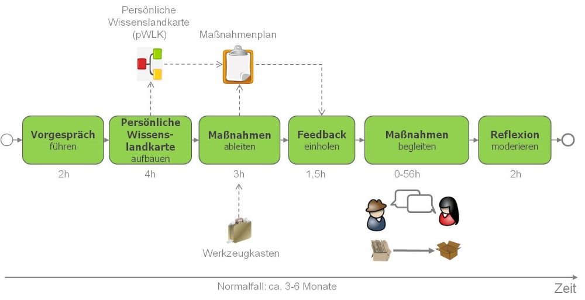

## Expert Debriefing Referenzprozess

Der Expert Debriefing Referenzprozess besteht aus sechs Schritten, die i.d.R. über einen Zeitraum von 3-6 Monaten ablaufen. In diesem Zeitraum steht oft ein Zeitkontingent von 5-10% der Arbeitszeit zur Verfügung. Die volle Arbeitszeit von Experte und Nachfolger zu nutzen ist nicht möglich, wenn der Experte noch in Tätigkeiten eingebunden ist.

Der Prozess beinhalte folgende Aufgaben für den Moderator:

1. **Vorgespräch führen:** Das Vorgespräch dient dazu, dem Auftraggeber und dem Experten den Zweck, die Vorgehensweise und die Ergebnisse eines Expert Debriefings aufzuzeigen, von den Beteiligten einen Überblick über die Situation und die Rahmenbedingungen zu erhalten, durch den Auftraggeber den Fokus für das Expert Debriefing festlegen zu lassen und die weiteren konkreten Schritte zu planen. Ein Expert Debriefing sollte immer auf freiwilliger Teilnahme des Experten basieren, da man Wissensteilung nicht erzwingen kann.
2. **Persönliche Wissenslandkarte aufbauen:** Die persönliche Wissenslandkarte dient dazu, einen systematischen und vollständigen Überblick über das gesamte in Bezug auf eine Stelle relevante Wissen herzustellen. Die Wissenslandkarte enthält i.d.R. aber keine ausführliche Wissensdokumentation (Struktur, kein Inhalt; "The Map is not the Territory"). Die persönliche Wissenslandkarte kann somit als Wissenslandkarte einer Stelle betrachtet werden. Die persönliche Wissenslandkarte beinhaltet im Gegensatz zu einer einfachen Mind Map eine vorstrukturierte erste Ebene (Arbeitshistorie, Aufgaben und Wissensgebiete), um systematisch das Gedächtnis und damit das implizite Wissen des Experten zu aktivieren (Episoden-, prozedurales und deklaratives Gedächtnis).
3. **Maßnahmen ableiten:** Die Ableitung eines Maßnahmen-Plans dient dazu, geeignete Maßnahmen zur Wissensbewahrung zu identifizieren, sie sowohl durch Experten als auch durch den Nachfolger priorisieren zu lassen und anschließend alle Maßnahmen zu terminieren.
4. **Feedback einholen:** Das Einholen des Feedbacks dient dazu, einen möglichst objektiven Überblick über die notwendigen Maßnahmen zur Wissensbewahrung zu erhalten und dem Auftraggeber (ggf. weiteren Kollegen) die Möglichkeit zu geben, in den Maßnahmen-Plan korrigierend einzugreifen.
5. **Maßnahmen begleiten:** Die Durchführung der im Maßnahmen-Plan festgelegten Maßnahmen ist der Kern des Expert Debriefings und dient der Wissensbewahrung durch Wissensidentifikation, Wissensdokumentation oder Wissenskooperation. Ziel ist, dass Experte und Nachfolger möglichst viele Maßnahmen in Eigenregie und in ihren Arbeitsalltag integriert durchführen. Der Moderator hat hier zwei Rollen: 1. Projektleiter: er wacht darüber, dass die im Maßnahmen-Plan festgelegten Maßnahmen durchgeführt werden. 2. Unterstützer: in 1:NN-Szenarien (Nachfolger noch nicht bekannt) oder bei komplexeren Maßnahmen unterstützt der Moderator bei konkreten Maßnahmen.
6. **Reflexion moderieren:** Die Reflexion dient der Umsetzungskontrolle sowie der kontinuierlichen Verbesserung der Methode Expert Debriefing. Darüber hinaus sollen Verbesserungspotentiale in der Organisation identifiziert werden, die den Einsatz der Methode Expert Debriefing langfristig überflüssig machen können. Optional können Vorgesetzter und Nachfolger ca. drei Monate nach Abschluss des Expert Debriefings befragt werden, ob die Übergabe durch die Methode besser war, als ohne und ob es zu größeren Überraschungen gekommen ist.

Die einzelnen Aufgaben werden in den folgenden Kapiteln im Detail erläutert.
