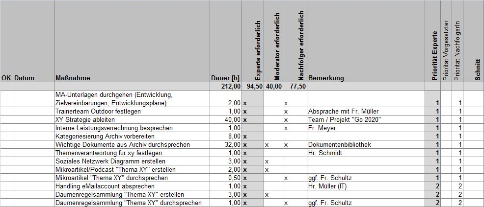

### Maßnahmen ableiten

Die Ableitung des **Maßnahmen-Plans** dient dazu, geeignete Maßnahmen zur Wissensbewahrung zu identifizieren, diese sowohl durch Experten als auch durch den Nachfolger priorisieren zu lassen und anschließend alle Maßnahmen zu terminieren. Damit wird ersichtlich, welche Maßnahmen ggf. nicht mehr in die zur Verfügung stehende Zeit passen.

#### Vorgehensweise (ca. 3 Stunden)

1. Übersicht Werkzeugkasten Expert Debriefing mit den einzelnen Werkzeugen erklären, damit alle Wissen, welche Möglichkeiten zur Verfügung stehen (Methoden wie Screencasts sind oft unbekannt).
2. Übernahme der bereits identifizierten Maßnahmen aus der persönlichen Wissenslandkarte.
3. Bereiche „Arbeitshistorie“, „Aufgaben“ und „Wissensgebiete“ in der persönlichen Wissenslandkarte durchgehen und überlegen, ob sich daraus notwendige Maßnahmen ergeben. Diese Maßnahmen ebenfalls in den Maßnahmen-Plan eintragen.
4. Je Maßnahme die (geschätzte) Dauer und die Beteiligten in den Maßnahmenplan eintragen
5. Maßnahmen im Maßnahmen-Plan durch den Experten und Nachfolger priorisieren lassen. Den Maßnahmen-Plan nach Priorisierung sortieren.
6. Prüfen, ob der ermittelte Aufwand durch den freigegebenen Aufwand aus dem Vorgespräch gedeckt ist (ggf. abgestuft nach Prioritäten).
7. Nach dem Feedbackgespräch mit dem Vorgesetzten werden alle Maßnahmen endgültig terminiert. Eingetragen wird das Datum, zu dem die Maßnahme fertiggestellt sein soll. Den Maßnahmen-Plan nach Terminierung sortieren.
    **Tipp:** wenn die Zeit des Experten knapp ist, sollten schon im Vorgespräch Termine im Kalender blockiert werden.
8. Empfehlenswert: Regeltermin vereinbaren, um den Status der Maßnahmenumsetzung durchzusprechen (z.B. 30 Minute alle zwei Wochen).
