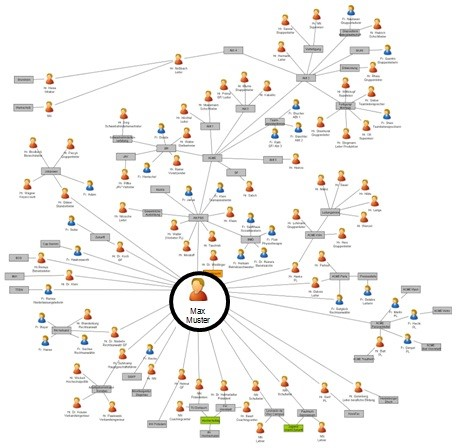

### Soziales Netzwerk Diagramm

Ein soziales Netzwerk Diagramm (auch Beziehungslandkarte) zeigt Personen (Knoten des Diagramms) und Beziehungen zwischen Personen (Kanten des Diagramms). Das Diagramm zeigt somit das Beziehungsgeflecht des Experten. Das Diagramm kann durch eine kommentierte Ansprechpartnerliste mit Hinweisen zu Personen und Institutionen ergänzt werden.

#### Vorgehensweise

1. Relevante Ansprechpartner in Ansprechpartnerliste eintragen.
 1. Welche Personen sind für die Ausführung der Aufgaben wichtig?
**Hinweis:** Personen können z.B. Kunden, Lieferanten, Partner, Interessensgruppen (Stakeholder), Wettbewerber, Verbände sein.
 1. Welche Personen kontaktieren Sie häufig?
 1. Welche Personen sind für Sie bei der Lösung von Problemen wichtig?
 1. Zu welchen Personen halten Sie regelmäßig Kontakt, um informiert zu sein?
 1. Für wen sind Sie wichtig? Wer kontaktiert Sie häufig?
2. Bei Bedarf: auch Organisationen, Projekte, Städte, Länder, Regionen etc. im Diagramm eintragen.
3. Beziehungen zwischen Ansprechpartnern (ggf. über Organisationen) in sozialem Netzwerk Diagramm darstellen.

#### Ressourcen und Hilfsmittel

* [yED](http://www.yworks.com) - Grafikeditor, zur Darstellung eines soziales Netzwerk Diagramms. Wichtige Funktion ist das automatische layouten des Netzwerks, da das sonst sehr viel manuellen Aufwand erzeugt.
