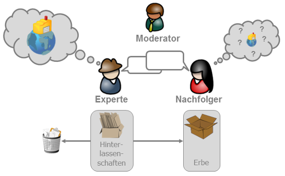

# Vorwort

Viele Organisationen sehen sich in der Wissensgesellschaft des 21. Jahrhundert mit einer ganz besonderen Situation konfrontiert. Durch Globalisierung, Digitalisierung sowie schnelle technologische und wissenschaftliche Entwicklung sehen sie sich einem bisher nicht da gewesenen Wettbewerbsdruck gegenübergestellt. Auch der Charakter der Arbeit hat sich geändert. Bestand die Arbeit 1930 noch zu ca. 80% aus manueller Routinearbeit, so dominiert heute die Wissensarbeit. Gleichzeitig führt die Alterung der Gesellschaft durch den [demografischen Wandel](https://de.wikipedia.org/wiki/Demografischer_Wandel), [Fachkräftemangel](https://de.wikipedia.org/wiki/Fachkr%C3%A4ftemangel) und [Jobrotationen](https://de.wikipedia.org/wiki/Jobrotation) zu Verlust von wertvollem [Erfahrungswissen](https://de.wikipedia.org/wiki/Erfahrungswissen) und Schwächung der  Innovationskraft. Deswegen sollten Unternehmen systematische Prozesse der  Wissenssicherung etablieren. Mit dem Expert Debriefing erlernst Du eine  Methode zur systematischen Bewahrung des [Wissens](https://de.wikipedia.org/wiki/Wissen) von [Experten](https://de.wikipedia.org/wiki/Experte).

Die Methode Expert Debriefing dient dazu, das Wissen eines ausscheidenden oder wechselnden Experten der Organisation zu bewahren sowie dem Experten Wertschätzung für seine Leistungen zu zeigen. Um diesen Prozess systematisch zu gestalten, wird ein Expert Debriefing von einem ausgebildeten Moderator begleitet. Expert Debriefings können bei Fach- und Führungskräften gleichermaßen sowie in allen funktionalen Bereichen (Marketing, Vertrieb, Entwicklung, Produktion, Service) durchgeführt werden. Der Begriff des Experten ist hierbei immer relativ in Beziehung zu einer Bezugsgruppe, den Laien, zu verstehen.

Da jeder Experte mit seinem Wissen und seiner Neigung zu Werkzeugen der Wissensbewahrung unterschiedlich sind, gibt es keinen One-Size-Fits-All-Ansatz geben. Der Expert Debriefing Referenzprozess ist deshalb so aufgebaut, dass zunächst in einer persönlichen Wissenslandkarte des Experten Überblick über alle möglichen Wissensgebiete aufgebaut wird, um dann auf Basis dieser Übersicht die wichtigsten Maßnahmen auszuwählen. Zur Auswahl der Maßnahmen steht die Expert Debriefing Toolbox mit praxiserprobten Tools und Methoden zur Verfügung.

Mit diesem Leitfaden lernst du alle Grundlagen des Expert Debriefings kennen. Mit den Übungen (Katas) aus dem Lernpfad lernst du den ganzen Prozess kennen.

# Über lernOS

**lernOS** ist ein [offenes System](https://de.wikipedia.org/wiki/Offenes_System) für [Lebenslanges Lernen](https://de.wikipedia.org/wiki/Lebenslanges_Lernen) und [Lernende Organisationen](https://de.wikipedia.org/wiki/Lernende_Organisation). Die Funktionsweise von lernOS wird in [offen](https://opendefinition.org/od/2.1/de/) verfügbaren **Leitfäden** beschrieben. lernOS kann ganz einfach als **Einzelperson**, im **Team** oder in der gesamten **Organisation** praktiziert werden.

Startest du als Einzelperson, empfehlen wir dir, gemeinsam in einem **Circle** (4-5 Personen) oder zumindest in einem **Lerntandem** (2 Personen) zu starten. Weitere Informationen findest du auf der Seite [lernos.org](http://lernos.org). Mitstreiter findest du ganz einfach in der [lernOS Community CONNECT](https://community.cogneon.de). Dort gibt es auch den [lernOS Circlefinder](https://community.cogneon.de/c/lernos/lernos-circlefinder/) als Marktplatz für Circle-Angebote und -Gesuche.

**KEEP CALM & LEARN ON!**

